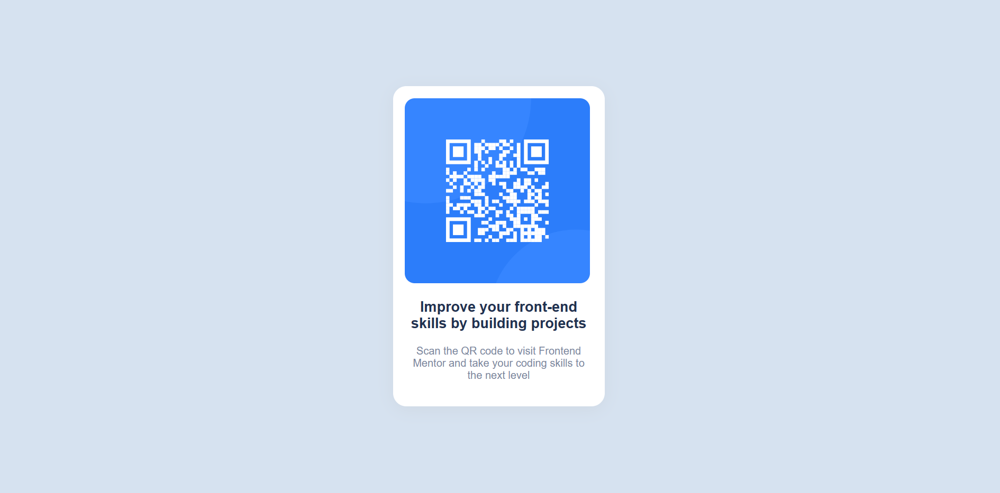

# Frontend Mentor - QR code component solution

This is a solution to the [QR code component challenge on Frontend Mentor](https://www.frontendmentor.io/challenges/qr-code-component-iux_sIO_H). Frontend Mentor challenges help you improve your coding skills by building realistic projects. 

## Table of contents

- [Overview](#overview)
  - [Screenshot](#screenshot)
  - [Links](#links)
- [My process](#my-process)
  - [Built with](#built-with)
  - [What I learned](#what-i-learned)
  - [Continued development](#continued-development)
  - [Useful resources](#useful-resources)
- [Author](#author)


## Overview

### Screenshot



### Links

- Solution URL: [https://jefferh30.github.io/QR-code-component/](https://jefferh30.github.io/QR-code-component/)
- Live Site URL: [https://jefferh30.github.io/QR-code-component/](https://jefferh30.github.io/QR-code-component/)

## My process

### Built with

- Semantic HTML5 markup
- CSS custom properties
- Flexbox
- Mobile-first workflow

### What I learned

Practiced the use of Flexbox and semantic HTML. Used the "main" and "footer" HTML elements.
Also practiced using git commands to push from local environment to github.

```html
<main>Inserted the QR component here</main>
<footer>Inserted attribution here</footer>
```
```css
.QR-card-parent{
    display: flex;
    justify-content: center;
    align-items: center;
    min-height: 100vh;
}
```


### Continued development

I need to keep practicing the use of git commands. I still get confused with some commands.

### Useful resources

- [Video for deploying to Github pages](https://www.youtube.com/watch?v=XGcuxuhV-Jg&t=453s) - This helped me in deploying from the local environment to Github pages.

## Author

- Website - [Jefferson Huera](https://www.neurochispas.com)
